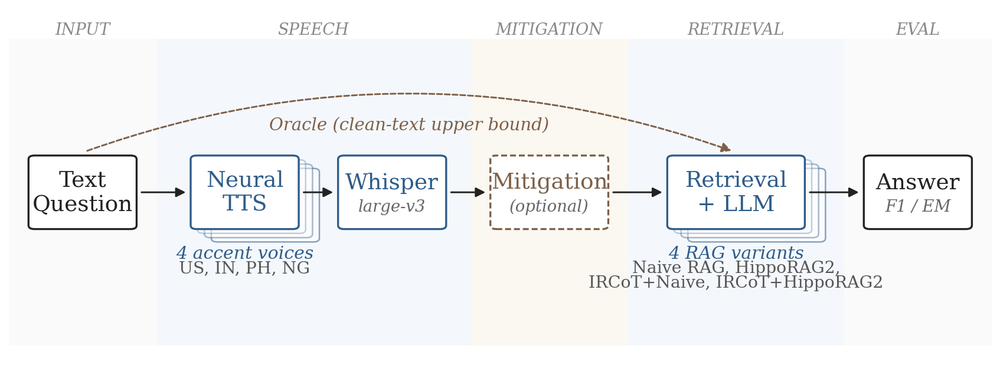

<div align="center">

# Spoken Multi-hop RAG

_Better Retrieval, Worse Robustness: How Multi-hop RAG Amplifies Upstream ASR Errors_

EMNLP 2026, Main Conference

[](https://arxiv.org/abs/2608.22872)
[](https://huggingface.co/datasets/KingZ23/spoken-multihop-rag)
[](LICENSE)
[](https://python.org)
[](https://github.com/openai/whisper)

</div>

<div align="center">

</div>

## 🎯 Overview

**Spoken Multi-hop RAG** is an evaluation suite for studying how
upstream ASR errors propagate through multi-hop retrieval-augmented
generation (RAG) architectures. We ask whether the architectural
sophistication of multi-hop RAG — specifically entity-graph linking
and iterative reformulation — absorbs or amplifies these upstream
errors.

The suite covers:

- **3 multi-hop QA benchmarks**: HotpotQA, 2WikiMultiHopQA, MuSiQue
- **4 English accents**: US, IN, PH, NG (synthesized via neural TTS)
- **4 RAG configurations**: Naive RAG, HippoRAG2, IRCoT+Naive,
  IRCoT+HippoRAG2
- **2 lightweight mitigations**: N-best Decoding, phonetic entity
  correction
- **Cross-system ASR validation**: Whisper-large-v3 + SeamlessM4T-v2-large
- **Real-speech validation**: 500 Nigerian-English utterances

<p align="center">
    🔨&nbsp;<a href="#-installation">Installation</a>
    | 🚀&nbsp;<a href="#-quick-start">Quick Start</a>
    | 📊&nbsp;<a href="#-datasets">Datasets</a>
    | 🏋️&nbsp;<a href="#-running-experiments">Experiments</a>
    | 🧪&nbsp;<a href="#-analysis-scripts">Analysis</a>
    | 🔗&nbsp;<a href="#-citation">Citation</a>
</p>

## 🔗 Citation

If you use this code or build on our findings, please cite:

```bibtex
@inproceedings{bao2026better,
  title     = {Better Retrieval, Worse Robustness: How Multi-hop {RAG} Amplifies Upstream {ASR} Errors},
  author    = {Bao, Zhenghua},
  booktitle = {Proceedings of the 2026 Conference on Empirical Methods in Natural Language Processing},
  year      = {2026},
  note      = {To appear},
  url       = {https://arxiv.org/abs/2608.22872}
}
```

Once the ACL Anthology entry is live, replace this with the Anthology
version and drop the `note` field.

## ✨ Key Findings

- **🔁 Structural amplification**: more sophisticated retrieval
  (graph + iterative) widens the Oracle-to-accent F1 gap by
  36%–67% relative to naive dense retrieval, on all three
  benchmarks.
- **🏷️ Entity corruption dominates**: corruption of one or more named
  entities is the dominant degradation category across all four
  retrieval configurations, at 87%–96% on 2WikiMultiHopQA,
  67%–82% on HotpotQA, and 54%–78% on MuSiQue.
- **🧪 Mitigation diagnostics**: N-best Decoding recovers ~0% of the
  gap; phonetic correction recovers 4%–11%, preferentially on
  graph-based methods. Together they isolate the residual to
  structural rather than stochastic or surface-level error.

## 🔨 Installation

### Prerequisites

- Python 3.10+
- CUDA-capable GPU (≥12 GB VRAM for Whisper / SeamlessM4T inference)
- ~4 GB RAM for HippoRAG2 parquet index

### Setup

```bash
git clone https://github.com/ZhenghuaBao/spoken-multihop-rag.git
cd spoken-multihop-rag

pip install -r requirements.txt
python -m spacy download en_core_web_sm
```

The OpenAI client is constructed with no explicit credentials, so it reads
`OPENAI_API_KEY` from the process environment. Nothing in the repository
loads a `.env` file, so exporting the variable is required:

```bash
export OPENAI_API_KEY=sk-...
```

The pipeline uses `gpt-4o-mini` for answer generation and
`text-embedding-3-small` for dense retrieval.

## 🚀 Quick Start

Run the main 48-cell evaluation table for one benchmark:

```bash
python experiments/run_2x2.py \
    --cells A C G H \
    --accent all+oracle \
    --accent-json data/hotpotqa_spoken/accent_nbest_results_hotpotqa.json \
    --ground-truth dataset/hotpotqa_1000_hf/ground_truth.json \
    --output results/hotpotqa_1000.json
```

This produces per-question F1/EM/WER plus per-cell summaries for
Oracle + 4 accents × 4 methods.

## 📊 Datasets

| Dataset | Domain | n | Question types |
|---|---|---|---|
| **HotpotQA** | Wikipedia | 1000 | bridge, comparison |
| **2WikiMultiHopQA** | Wikipedia | 1000 | + compositional, inference |
| **MuSiQue** | Wikipedia | 1000 | 2-, 3-, 4-hop compositions |

All three are sampled uniformly at random from the official
development split with seed `42`.

### Expected local layout

Speech audio, ASR transcripts, benchmark files and prebuilt indexes are
**not bundled with the code** (they are large, and the transcripts depend
on a pinned ASR checkpoint). Every script takes explicit path arguments
whose defaults resolve inside the repository, so the layout below is what
a full local checkout looks like:

```
dataset/<benchmark>/ground_truth.json   # answers, from the prepare scripts
dataset/<benchmark>/documents/          # retrieval corpus (one .txt per doc)
data/<benchmark>_spoken/audio/<accent>/ # synthesized .wav, from data/build_dataset.py
data/<benchmark>_spoken/accent_nbest_results_<benchmark>.json  # ASR transcripts
hipporag_outputs/<benchmark>/           # HippoRAG2 index
vector_store/<index-name>/              # FAISS index for naive dense retrieval
```

All of these are gitignored. Running a script with a missing input fails
immediately with the flag and path it expected, before any API call.

Accent synthesis uses Microsoft Edge TTS:

| Code | Voice | Role |
|---|---|---|
| US | `en-US-JennyNeural` | High-resource baseline |
| IN | `en-IN-NeerjaNeural` | Non-native (Indian English) |
| PH | `en-PH-RosaNeural` | Non-native (Filipino English) |
| NG | `en-NG-EzinneNeural` | Low-resource (Nigerian English) |

## 🏋️ Running Experiments

### Main 2x2 experiment

```bash
python experiments/run_2x2.py \
    --cells A B C D G H I J \
    --accent all+oracle \
    --ircot-steps 3 \
    --output results/2wiki_1000.json
```

Cell codes:

| Cell | Method | Variant |
|---|---|---|
| A / B | Naive RAG | top-1 / N-best |
| C / D | HippoRAG2 | top-1 / N-best |
| G / I | IRCoT+Naive | top-1 / N-best |
| H / J | IRCoT+HippoRAG2 | top-1 / N-best |
| E / F | Oracle (clean text) | Naive / HippoRAG2 |

### Phonetic entity correction (Table 3)

```bash
python experiments/phonetic_correction_v2.py \
    --asr-data data/2wiki_spoken/accent_nbest_results_2wiki.json \
    --docs-dir dataset/2wikimultihopqa_1000/documents \
    --accent ng --use-spacy \
    --jaccard 0.4 --edit-thresh 75 --fallback-thresh 85 \
    --output data/2wiki_spoken/accent_nbest_results_2wiki_phonetic_v2.json
```

### Cross-system ASR check (SeamlessM4T)

```bash
python asr/transcribe_seamless_server.py \
    --audio-dir data/2wiki_spoken/audio/ng \
    --output data/2wiki_spoken/ng_seamless_transcripts.json
```

## 🧪 Analysis Scripts

Each script in `evaluation/scripts/` reproduces one paper artifact. See
[`evaluation/README.md`](evaluation/README.md) for full invocation
strings.

| Paper artifact | Script |
|---|---|
| Table 1 stats (p-values, CIs) | `bootstrap_significance.py` |
| Table 2 (Error-type distribution per accent) | `error_type_distribution.py` |
| Table 3 (Mitigation: top-1 / N-best / Phonetic) | `mitigation_table.py` |
| Table 8 (Entity corruption per method and accent) | `cross_method_entity_table.py` |
| Figure 3 (WER-stratified degradation) | `wer_stratified_degradation.py` |
| Appendix E (entity corruption, real vs synthetic NG) | `entity_corruption_analysis.py` |
| Appendix E (real-speech WER) | `real_speech_validation.py` |

All paths are relative to `evaluation/scripts/`.

## 📁 Project Structure

```
spoken-multihop-rag/
├── asr/                    # Speech transcription (Whisper, SeamlessM4T)
├── data/                   # Dataset build/load utilities
├── evaluation/
│   ├── core/               # Metrics + error categorization (pipeline imports)
│   └── scripts/            # One-shot analyses (each → 1 paper artifact)
├── experiments/            # Main runner + mitigation experiments
├── retrieval/              # Dense + HippoRAG2 wrappers
├── dataset/                # Benchmark ground truth + corpora (gitignored)
├── results/                # Per-cell outputs (gitignored)
├── logs/                   # Run logs (gitignored)
├── figure/                 # README assets
├── requirements.txt
├── LICENSE
└── README.md
```

## ⚙️ Configuration

Key parameters (defaults match the paper):

| Parameter | Default | Where |
|---|---|---|
| LLM model | `gpt-4o-mini` | `run_2x2.py --llm-model` |
| Embedding model | `text-embedding-3-small` | `run_2x2.py --embed-model` |
| Retrieval top-k | 10 | `run_2x2.py --top-k` |
| IRCoT depth | 3 | `run_2x2.py --ircot-steps` |
| HippoRAG2 damping | 0.5 | Inside `retrieval/hipporag.py` |
| Phonetic Jaccard min | 0.4 | `phonetic_correction_v2.py --jaccard` |
| Phonetic edit threshold | 75 | `--edit-thresh` |
| Full-corpus fallback threshold | 85 | `--fallback-thresh` |
| Bootstrap resamples | 10,000 | `bootstrap_significance.py --n-resamples` |

## 🙏 Acknowledgments

- **HippoRAG2** — Original implementation by
  [OSU-NLP-Group](https://github.com/OSU-NLP-Group/HippoRAG).
- **IRCoT** — Trivedi et al. 2023 (ACL).
- **Whisper** — Radford et al. 2023 (ICML).
- **SeamlessM4T** — Barrault et al. 2023.
- **Nigerian-accented English speech dataset** —
  [benjaminogbonna/nigerian_accented_english_dataset](https://huggingface.co/datasets/benjaminogbonna/nigerian_accented_english_dataset).

## 📄 License

This project is released under the
[Apache License 2.0](LICENSE). You are free to use, modify, and
distribute the code, subject to the terms in `LICENSE`. Third-party
components (HippoRAG2, IRCoT, Whisper, SeamlessM4T, spaCy, RapidFuzz,
etc.) retain their own licenses.
